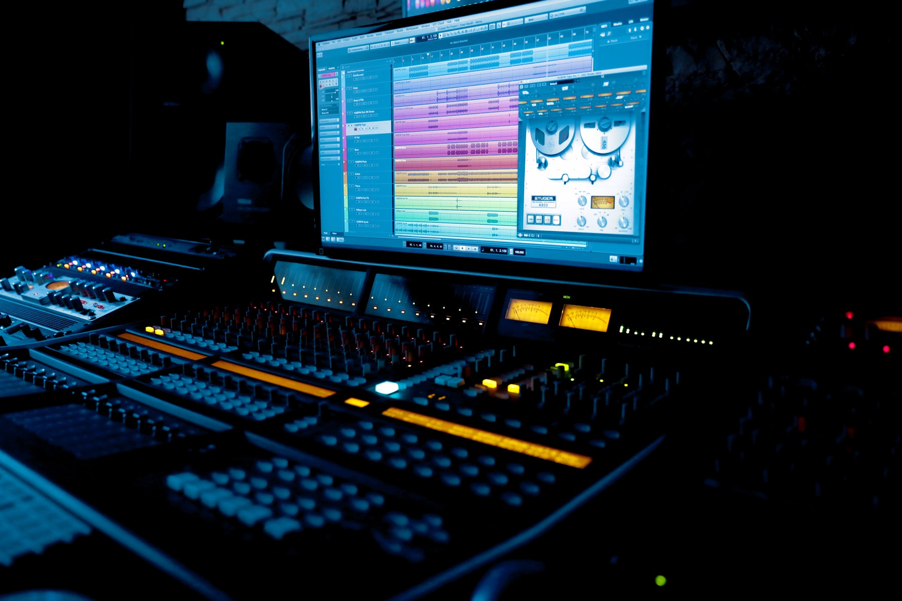

Over this winter break, I found myself using multiple tools for AI music generation to co-create a song with AI. After a couple of songs and lots of files I ended up creating a track that represents the current state of widely available AI music generation models and created this song called "Morning Tide." Below is my process document that contains the various iterations of the project along with the final submission that I used for an AI song writing competition at the Frost School of Music.

<a class="button" href="https://drive.google.com/file/d/1rxB25hW8F2-TJ8Jpqco56LWYEiV_aOlA/view?usp=sharing">Link to Process Document</a>

