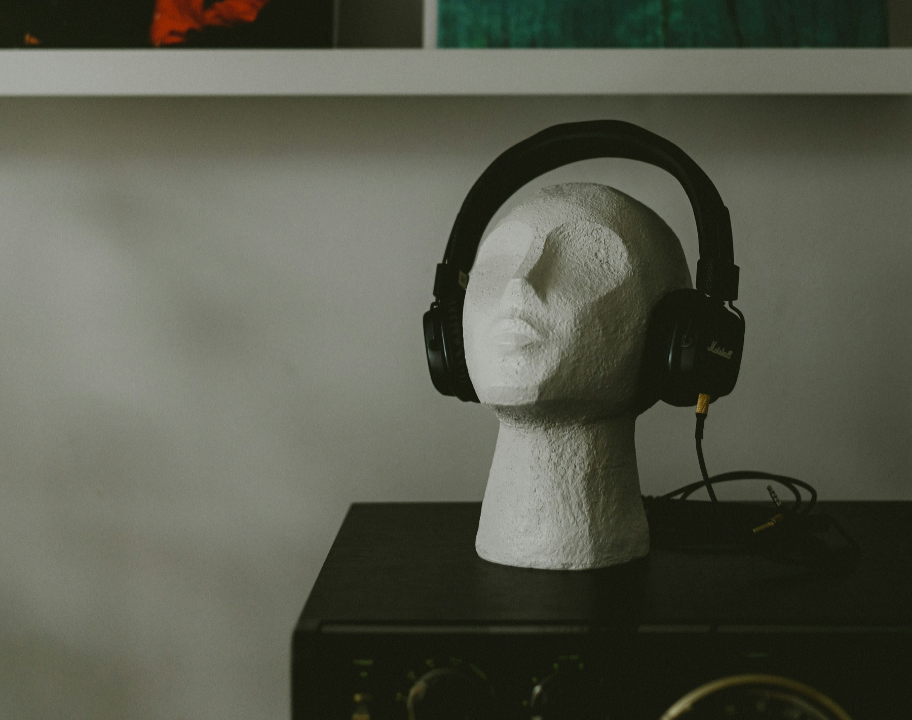

For a project in my Design with AI class, I created an emotion classifier using Apple's developer tool CreateML. I pre-processed a dataset of facial expressions and then trained the model at different dataset sizes to test the effect of training data on performance.

As a fun addition, I used Google's Music AI Studio Prompt DJ to map genres and emotions to an XY grid using a similar expression classifier in Google's API. Now you can make a facial expression and generate music that responds to your emotion in real time. Scroll down to the bottom of the process document to test the tool!

<a class="button" href="https://drive.google.com/file/d/1-qT7gFl1qTK5jJHZtqmXjXclisLs1EHr/view?usp=sharing">View Process Document</a>

