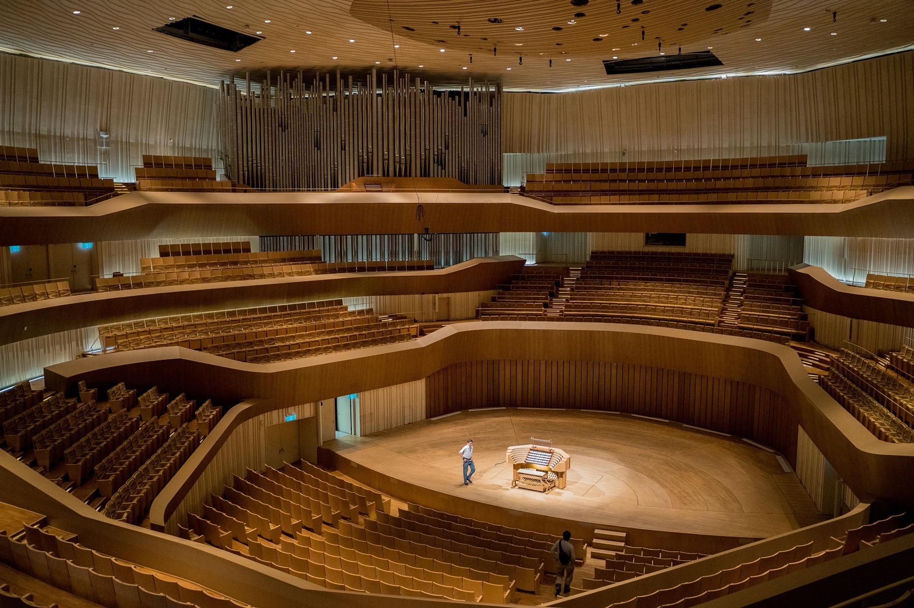

I had the wonderful opportunity to create a graphic user interface for a a student's thesis project.

Nicolas Adler measured and reported the Speech Transmission Index of all the concert halls in the Frost School of Music. After measuring, he was able to reconstruct impulse responses that represented the natural reverb that occurred in each room.

I created a GUI that best reflected the Frost School of Music brand and communicated the digital signal processing developed by Nicolas in a simple manner. An open-source downloadable version of the plug-in is on the way!

Check out the process document and how the final GUI looks below!

<a class="button" href="https://drive.google.com/file/d/1cA-11t1BD3z3HXRuMfEhFZxnxVnyMP1F/view?usp=sharing">FrostVerb Process Document</a> <a class="button" href="https://drive.google.com/file/d/1JxiY4F-qIJSBo0jcqqI_dhfRgBHvQKYj/view?usp=sharing">FrostVerb Demo</a>

