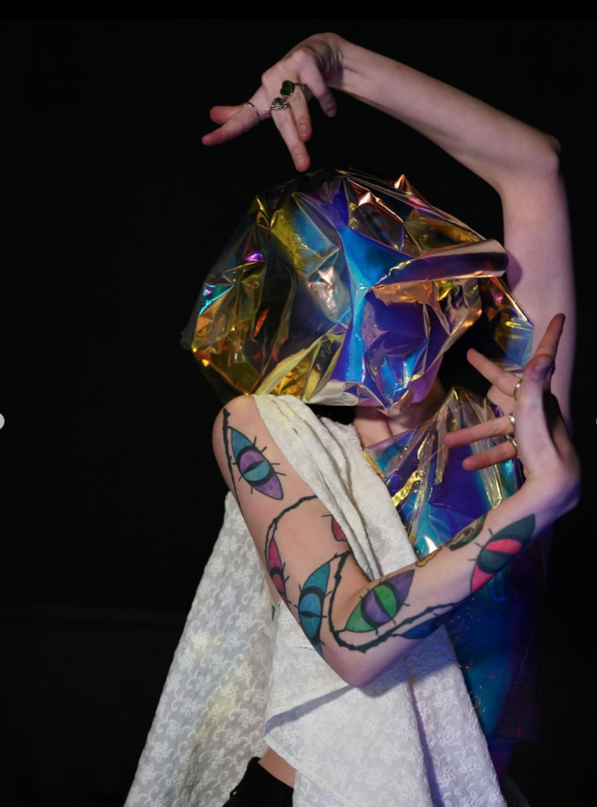
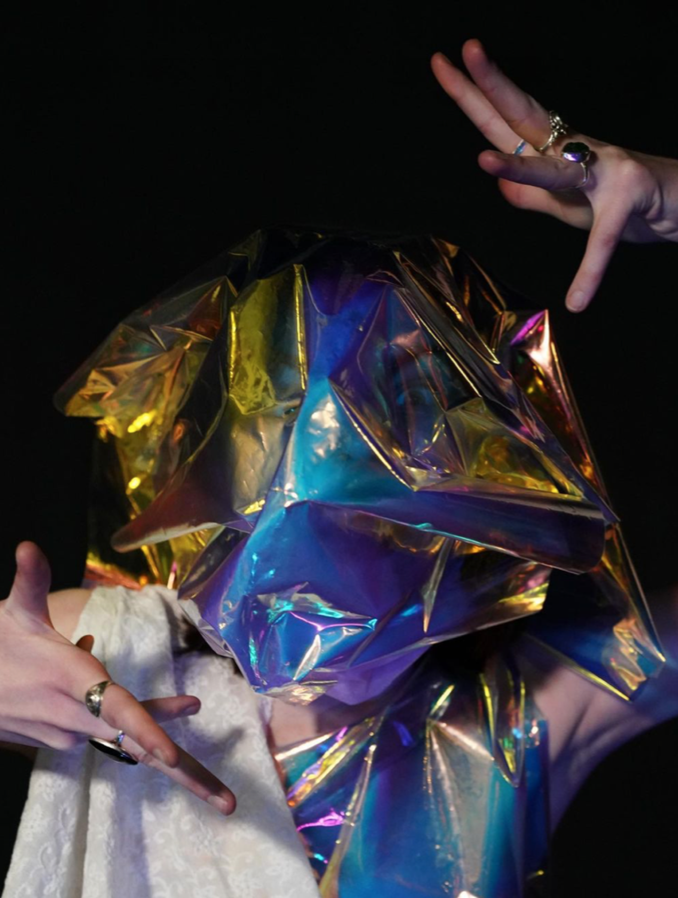
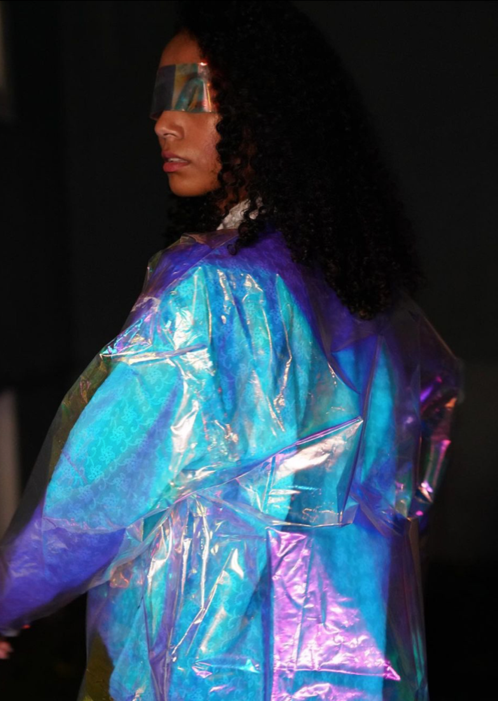
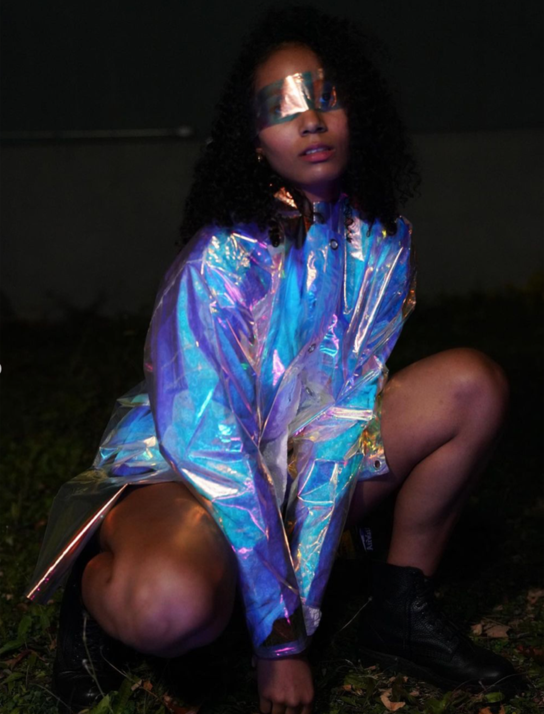
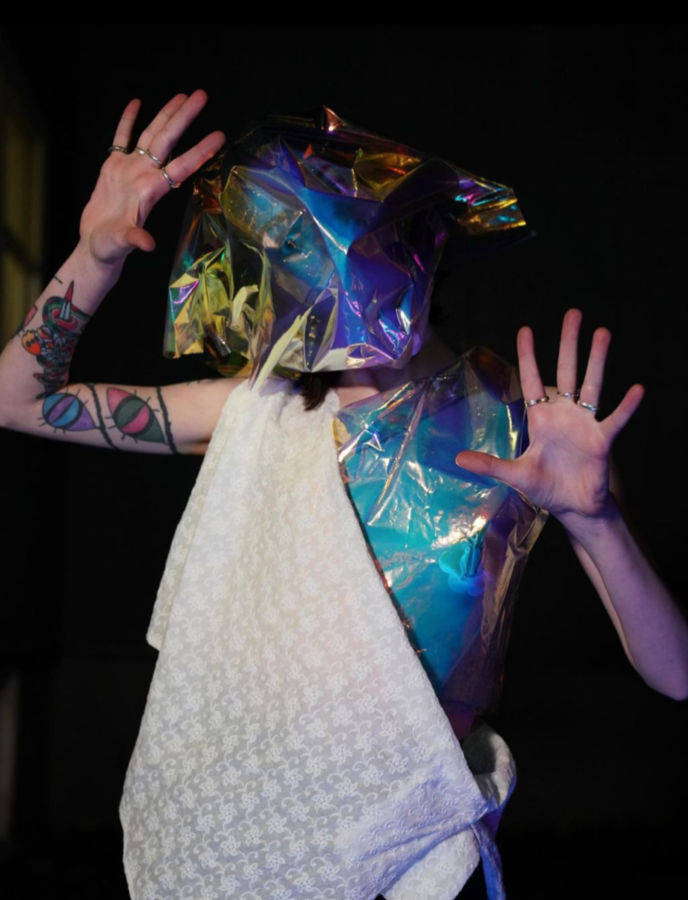

Body & Space is an architecture and fashion exhibition in Syracuse, NY which is themed on the relationship between human subjects and their environments. Their 2020 fashion show requested designers to create clothes that prompt the audience to question how bodies of different sizes, and socioeconomic, racial, and political backgrounds are understood in today's cityscapes. For this project, I wanted to juxtapose using a futuristic material to create garments that are found traditionally in India.

While searching for materials I came across a polarized plastic that reflects light at different wavelengths when viewed at different angles and decided to use it to create both the kurta and a salwar kameez. Since this material was translucent I added a white patterned fabric, often used to create punjabis, underneath the plastic kurta and as a shawl for the salwar. These elements combined to create a futuristic yet traditional aesthetic that falls under the genre of Indofuturism.

This year's fashion show was the first to be done all online as a collaboration between the university's Fashion and Design Society x Body and Space. I worked with the FADS photo and video team to edit photos and videos recorded in various locations and finally screen the full show in a zoom meeting with all members and participants from both organizations.

models: Coumba Kante & Phoebe Smith

photos: Jessie Zhai
