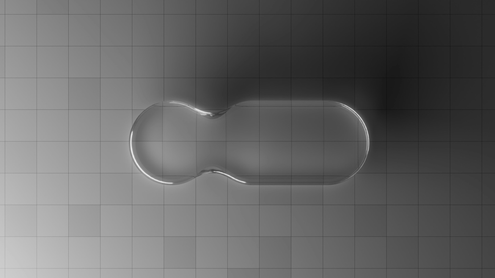

This summer, I created a JUCE plugin which was inspired by the stock Pro Tools Channel Strip. This plugin consisted of an 8-band EQ and compressor/expander. My favorite part of the project was building elements that allow users to manipulate frequency and dynamics by dragging nodes and lines across a visual interface. I perfected the design of this interactive element and created Interactive Nodes. These nodes bring the experience of Ableton's EQ 8 or Fab-Filter's Pro Q 4 to simpler plug-ins.

Interactive Nodes can be dropped in any JUCE or C++ audio plug-in, allowing users to control audio parameters visually. I had a lot of fun making this project, and an open-source, downloadable version of my code is on its way!

