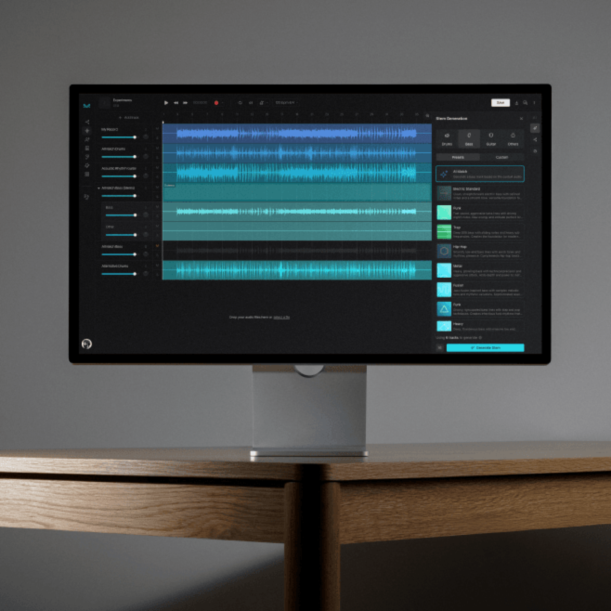

This summer, I had the opportunity to work with a company called Moises to develop AI tools for music practice, production, and education. I created a demo and presentation that was a part of their educators' workshop, where professors attended a webinar to understand the tool and ideate how to integrate it into their music curriculum.

Additionally, I collaborated with Moises and the Frost School of Music at the University of Miami to implement an educational license deal for professors and students to access the full capabilities of the platform for the 2025-26 school year.

View my presentation at the link below.

<a class="button" href="https://docs.google.com/presentation/d/e/2PACX-1vSflAXRu7fd0uAJVvxWLN4oPri1x6bLCVl9jfJVSE2wUsgB2x5eY7d9M7-svSfgy2NawPOVrF4L_RZN/pub?start=true&loop=true&delayms=3000&slide=id.g3763398177a_0_18">Moises AI Workshop Presentations</a>

