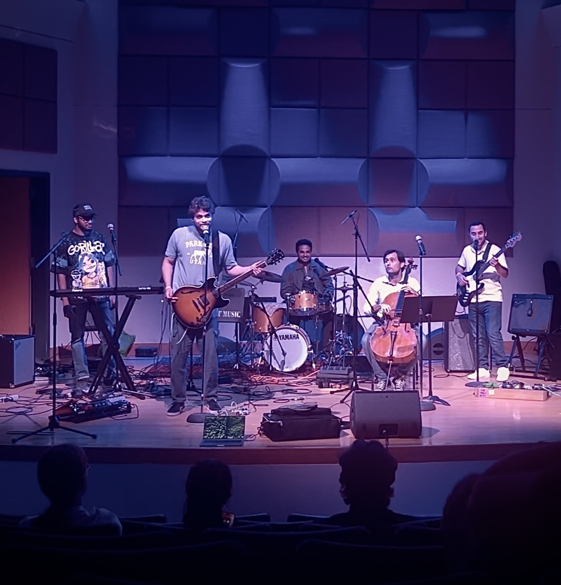
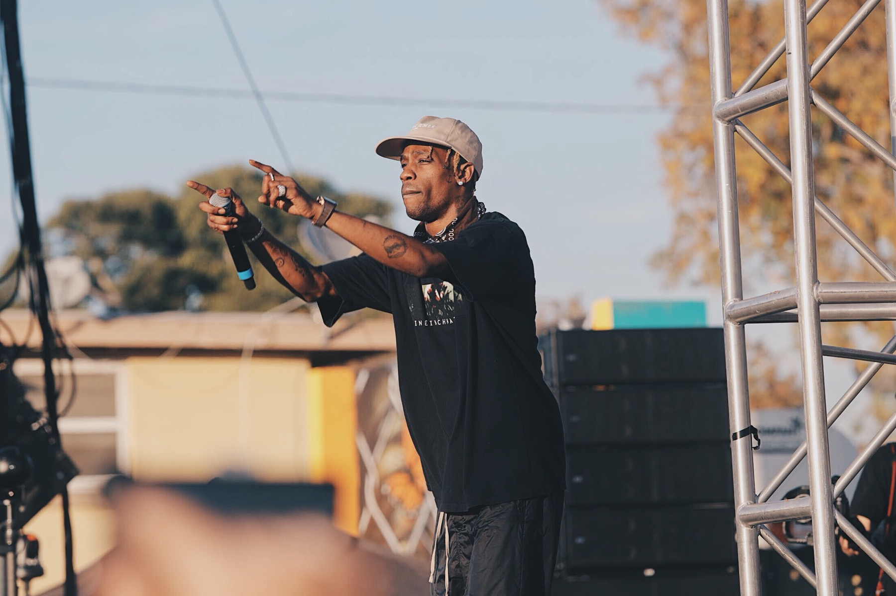

At the end of the school year, my fellow graduate students and I banded together to make an unconventional music group. Zachary Patchen (guitar), Brandon Ferrante (Bass), Aditya Jeganath Koothapakkam (keyboard), Nicolas Adler (cello), and I (vocals and drum set) created a band called Quantum Gourami.

We practiced and developed some repertoire to perform at the music engineering concert at the Frost School of Music. Zachary Patchen arranged All Apologies by Nirvana for our group, and I took on the task of arranging the infamous meme song: FE!N by Travis Scott and Playboi Carti.

We utilized epic saw synths and TC Helicon VoiceTone pedals to bridge the rock instrumentation with the hip-hop composition. I rapped the verses while the group collectively sang the chorus line: "FE!N!"

